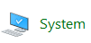
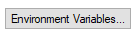
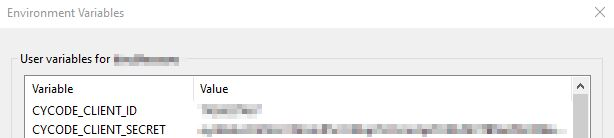

# Cycode CLI User Guide

The Cycode Command Line Interface (CLI) is an application you can install on your local machine which can scan your locally stored repositories for any secrets or infrastructure as code misconfigurations.

This guide will guide you through both installation and usage.

# Prerequisites

- The Cycode CLI application requires Python version 3.8 or later.
- A Cycode Client ID and Client Secret Key are required to use the product. See the [Service Account Token](https://docs.cycode.com/reference/creating-a-service-account-access-token) and [Personal Access Token](https://docs.cycode.com/reference/creating-a-personal-access-token-1) pages for details on obtaining this value.

# Installation

The following installation steps are applicable on both Windows and UNIX / Linux operating systems.

> :memo: **Note**<br/>
> The following steps assume the use of `python3` and `pip3` for Python-related commands, but some systems may instead use the `python` and `pip` commands, depending on your Python environment’s configuration.
## Install Cycode CLI

To install the Cycode CLI application on your local machine, perform the following steps:

1. Open your command line or terminal application.

2. Execute the following command:

   `pip3 install cycode`

3. Navigate to the top directory of the local repository you wish to scan.

4. There are two methods to set the Cycode client ID and client secret:

   - [cycode configure](#use-configure-command) (recommended)
   - Add them to your [environment variables](#add-to-environment-variables)

### Use configure Command

> :memo: **Note**<br/>
> If you already setup your Cycode client ID and client secret through the Linux or Windows environment variables those credentials will take precendent over this method
1. Type the following command into your terminal/command line window:

   `cycode configure`

   You will see the following appear:

    ```bash
    Update credentials in file (/Users/travislloyd/.cycode/credentials.yaml)
    cycode client id []:
    ```

2. Enter your Cycode client ID value.

    ```bash
    cycode client id []: 7fe5346b-xxxx-xxxx-xxxx-55157625c72d
    ```

3. Enter your Cycode client secret value.

    ```bash
    cycode client secret []: c1e24929-xxxx-xxxx-xxxx-8b08c1839a2e
    ```

4. If the values were entered successfully, you will see the following message:

    ```bash
    Successfully configured CLI credentials!
    ```

If you go into the `.cycode` folder under you user folder, you will find these credentials were created and placed in the `credentials.yaml` file in that folder.

### Add to Environment Variables

#### On Unix/Linux:

```bash
export CYCODE_CLIENT_ID={your Cycode ID}
export CYCODE_CLIENT_SECRET={your Cycode Secret Key}
```

#### On Windows

1. From the Control Panel, navigate to the System menu:



2. Next, click Advanced system settings:


3. In the System Properties window that opens, click the Environment Variables button:



4. Create `CYCODE_CLIENT_ID` and `CYCODE_CLIENT_SECRET` variables with values matching your ID and Secret Key, respectively:



## Install Pre-Commit Hook

Cycode’s pre-commit hook can be set up within your local repository so that the Cycode CLI application will automatically identify any issues with your code before you commit it to your codebase.

Perform the following steps to install the pre-commit hook:

1. Install the pre-commit framework:

   `pip3 install pre-commit`

2. Navigate to the top directory of the local repository you wish to scan.

3. Create a new YAML file named `.pre-commit-config.yaml` (include the beginning `.`) in the repository’s top directory that contains the following:

```yaml
repos:
  - repo: https://github.com/cycodehq-public/cycode-cli
    rev: 0.1.2
    hooks:
      - id: cycode
        language_version: python3
        stages:
          - commit
```

4. Install Cycode’s hook:

   `pre-commit install`

> :memo: **Note**<br/>
> Successful hook installation will result in the message:<br/>
`Pre-commit installed at .git/hooks/pre-commit`
# Cycode Command

The following are the options and commands available with the Cycode CLI application:

| Option            | Description                 |
|-------------------|-----------------------------|
| `-v`, `--verbose` | Show detailed logs          |
| `--version`       | Show the version and exit.  |
| `--help`          | Show options for given command. |

| Command                             | Description |
|-------------------------------------|-------------|
| [configure](#use-configure-command) | Initial command to authenticate your CLI client with Cycode using client ID and client secret. |
| [ignore](#ingoring-scan-results)    | Ignore a specific value, path or rule ID |
| [scan](#running-a-scan)             | Scan content for secrets/IaC violations, You need to specify which scan type: `ci`/`commit_history`/`path`/`repository`/etc |

# Running a Scan

The Cycode CLI application offers several types of scans so that you can choose the option that best fits your case. The following are the current options and commands available:

| Option                         | Description                                                                |
|---------------------------------|----------------------------------------------------------------------------|
| `-t, --scan-type [secret\|iac]` | Specify the scan you wish to execute (`secret`/`iac`), the default is secret |
| `--secret TEXT`                 | Specify a Cycode client secret for this specific scan execution              |
| `--client-id TEXT`              | Specify a Cycode client ID for this specific scan execution   |
| `--show-secret BOOLEAN`         | Show secrets in plain text. See [Show/Hide Secrets](#showhide-secrets) section for more details. |
| `--soft-fail BOOLEAN`           | Run scan without failing, always return a non-error status code. See [Soft Fail](#soft-fail) section for more details. |
| `--help`                        | Show options for given command.                                                |

| Command          | Description                                                     |
|------------------|-----------------------------------------------------------------|
| [commit_history](#commit-history-scan) | Scan all the commits history in this git repository             |
| [path](#path-scan)                     | Scan the files in the path supplied in the command              |
| [pre_commit](#pre-commit-scan)         | Use this command to scan the content that was not committed yet |
| [repository](#repository-scan)         | Scan git repository including its history                       |

## Repository Scan

A repository scan examines an entire local repository for any exposed secrets or insecure misconfigurations. This more holistic scan type looks at everything: the current state of your repository and its commit history. It will look not only for currently exposed secrets within the repository but previously deleted secrets as well.

To execute a full repository scan, execute the following:

`cycode scan repository {{path}}`

For example, consider a scenario in which you want to scan your repository stored in `~/home/git/codebase`. You could then execute the following:

`cycode scan repository ~/home/git/codebase`

The following option is available for use with this command:

| Option              | Description |
|---------------------|-------------|
| `-b, --branch TEXT` | Branch to scan, if not set scanning the default branch |

### Branch Option

To scan a specific branch of your local repository, add the argument `-b` (alternatively, `--branch`) followed by the name of the branch you wish to scan.

Consider the previous example. If you wanted to only scan a branch named `dev`, you could execute the following:

`cycode scan repository ~/home/git/codebase -b dev`

or:

`cycode scan repository ~/home/git/codebase --branch dev`

## Path Scan

A path scan examines a specific local directory and all the contents within it, instead of focusing solely on a GIT repository.

To execute a directory scan, execute the following:

`cycode scan path {{path}}`

For example, consider a scenario in which you want to scan the directory located at `~/home/git/codebase`. You could then execute the following:

`cycode scan path ~/home/git/codebase`

## Commit History Scan

A commit history scan is limited to a local repository’s previous commits, focused on finding any secrets within the commit history, instead of examining the repository’s current state.

To execute a commit history scan, execute the following:

`cycode scan commit_history {{path}}`

For example, consider a scenario in which you want to scan the commit history for a repository stored in `~/home/git/codebase`. You could then execute the following:

`cycode scan commit_history ~/home/git/codebase`

The following option is available for use with this command:

| Option                    | Description |
|---------------------------|-------------|
| `-r, --commit_range TEXT` | Scan a commit range in this git repository, by default cycode scans all commit history (example: HEAD~1) |

### Commit Range Option

The commit history scan, by default, examines the repository’s entire commit history, all the way back to the initial commit. You can instead limit the scan to a specific commit range by adding the argument `--commit_range` followed by the name you specify.

Consider the previous example. If you wanted to scan only specific commits on your repository, you could execute the following:

`cycode scan commit_history -r {{from-commit-id}}...{{to-commit-id}} ~/home/git/codebase`

OR

`cycode scan commit_history --commit_range {{from-commit-id}}...{{to-commit-id}} ~/home/git/codebase`

## Pre-Commit Scan

A pre-commit scan automatically identifies any issues before you commit changes to your repository. There is no need to manually execute this scan; simply configure the pre-commit hook as detailed under the Installation section of this guide.

After your install the pre-commit hook and, you may, on occasion, wish to skip scanning during a specific commit. Simply add the following to your `git` command to skip scanning for a single commit:

`SKIP=cycode git commit -m <your commit message>`

# Scan Results

Each scan will complete with a message stating if any issues were found or not.

If no secrets or misconfigurations are found, the scan ends with the following success message:

`Good job! No issues were found!!! 👏👏👏`

If a secret or misconfiguration is found, a `Found issue of type:` message appears upon completion instead:

```bash
⛔  Found issue of type: generic-password (rule ID: ce3a4de0-9dfc-448b-a004-c538cf8b4710) in file: config/my_config.py
Secret SHA: a44081db3296c84b82d12a35c446a3cba19411dddfa0380134c75f7b3973bff0  ⛔
0 | @@ -0,0 +1 @@
1 | +my_password = 'h3l***********350'
2 | \ No newline at end of file
```

In the event an issue is found, review the file in question for the specific line highlighted by the result message. Implement any changes required to resolve the issue, then execute the scan again.

## Show/Hide Secrets

In the above example, a secret was found in the file `secret_test`, located in the subfolder `cli`. The second part of the message shows the specific line the secret appears in, which in this case is a value assigned to `googleApiKey`.

Note how the above example obscures the actual secret value, replacing most of the secret with asterisks. Scans obscure secrets by default, but you may optionally disable this feature in order to view the full secret (assuming the machine you are viewing the scan result on is sufficiently secure from prying eyes).

To disable secret obfuscation, add the `--show-secret` argument to any type of scan, then assign it a `1` value to show the full secret in the result message, or `0` to hide the secret (which is done by default).

In the following example, a Path Scan is executed against the `cli` subdirectory with the option enabled to display any secrets found in full:

`cycode scan --show-secret=1 path ./cli`

The result would then not be obfuscated:

```bash
⛔  Found issue of type: generic-password (rule ID: ce3a4de0-9dfc-448b-a004-c538cf8b4710) in file: config/my_config.py
Secret SHA: a44081db3296c84b82d12a35c446a3cba19411dddfa0380134c75f7b3973bff0  ⛔
0 | @@ -0,0 +1 @@
1 | +my_password = 'h3110w0r1d!@#$350'
2 | \ No newline at end of file
```

## Soft Fail

Utilizing the soft fail feature will not fail the CI/CD step within the pipeline if the Cycode scan finds an issue. Additionally, in case an issue occurs from Cycode’s side, a soft fail will automatically execute to avoid interference.

Add the `--soft-fail` argument to any type of scan to configure this feature, then assign a value of `1` if you want found issues to result in a failure within the CI/CD tool or `0` for scan results to have no impact (result in a `success` result).

# Ignoring Scan Results

Ignore rules can be added to ignore specific secret values, specific SHA512 values, specific paths, and specific Cycode secret and IaC rule IDs. This will cause the scan to not alert these values. The ignore rules are written and saved locally in the `./.cycode/config.yaml` file.

> :warning: **Warning**<br/>
> Adding values to be ignored should be done with careful consideration of the values, paths, and policies to ensure that the scans will pick up true positives.
The following are the options available for the `cycode ignore` command:

| Option                          | Description |
|---------------------------------|-------------|
| `--by-value TEXT`               | Ignore a specific value while scanning for secrets. See [Ignoring a Secret Value](#ignoring-a-secret-value) for more details. |
| `--by-sha TEXT`                 | Ignore a specific SHA512 representation of a string while scanning for secrets. See [Ignoring a Secret SHA Value](#ignoring-a-secret-sha-value) for more details. |
| `--by-path TEXT`                | Avoid scanning a specific path. Need to specify scan type. See [Ignoring a Path](#ignoring-a-path) for more details. |
| `--by-rule TEXT`                | Ignore scanning a specific secret rule ID/IaC rule ID. See [Ignoring a Secret or Iac Rule](#ignoring-a-secret-or-iac-rule) for more details. |
| `-t, --scan-type [secret\|iac]` | The scan you wish to run, The default value is `secret` |
| `-g, --global`                  | Add an ignore rule and update it in the global .cycode config file |

In the following example, a pre-commit scan runs and finds the following:

```bash
⛔  Found issue of type: generic-password (rule ID: ce3a4de0-9dfc-448b-a004-c538cf8b4710) in file: config/my_config.py
Secret SHA: a44081db3296c84b82d12a35c446a3cba19411dddfa0380134c75f7b3973bff0  ⛔
0 | @@ -0,0 +1 @@
1 | +my_password = 'h3l***********350'
2 | \ No newline at end of file
```

If this is a value that is not a valid secret, then use the the `cycode ignore` command to ignore the secret by its value, SHA512 value, specific path, or rule ID. If this is an IaC scan, then you can ignore that result by its path or rule ID.

## Ignoring a Secret Value

To ignore a specific secret value, you will need to use the `--by-value` flag. This will ignore the given secret value from all future scans. Use the following command to add a secret value to be ignored:

`cycode ignore --by-value {{secret-value}}`

In the example at the top of this section, the command to ignore a specific secret value is as follows:

`cycode ignore --by-value h3110w0r1d!@#$350`

In the example above, replace the `h3110w0r1d!@#$350` value with your non-masked secret value. See the Cycode scan options for details on how to see secret values in the scan results.

## Ignoring a Secret SHA Value

To ignore a specific secret SHA value, you will need to use the `--by-sha` flag. This will ignore the given secret SHA value from all future scans. Use the following command to add a secret SHA value to be ignored:

`cycode ignore --by-sha {{secret-sha-value}}`

In the example at the top of this section, the command to ignore a specific secret SHA value is as follows:

`cycode ignore --by-sha a44081db3296c84b82d12a35c446a3cba19411dddfa0380134c75f7b3973bff0`

In the example above, replace the `a44081db3296c84b82d12a35c446a3cba19411dddfa0380134c75f7b3973bff0` value with your secret SHA value.

## Ignoring a Path

To ignore a specific path for either secret or IaC scans, you will need to use the `--by-path` flag in conjunction with the `-t, --scan-type` flag (you must specify the scan type). This will ignore the given path from all future scans for the given scan type. Use the following command to add a path to be ignored:

`cycode ignore -t {{scan-type}} --by-path {{path}}`

OR

`cycode ignore --scan-type {{scan-type}} --by-path {{path}}`

In the example at the top of this section, the command to ignore a specific path for a secret is as follows:

`cycode ignore -t secret --by-path ~/home/my-repo/config`

In the example above, replace the `~/home/my-repo/config` value with your path value.

In the example at the top of this section, the command to ignore a specific path from IaC scans is as follows:

`cycode ignore -t iac --by-path ~/home/my-repo/config`

In the example above, replace the `~/home/my-repo/config` value with your path value.

## Ignoring a Secret or IaC Rule

To ignore a specific secret or IaC rule, you will need to use the `--by-rule` flag in conjunction with the `-t, --scan-type` flag (you must specify the scan type). This will ignore the given rule ID value from all future scans. Use the following command to add a rule ID value to be ignored:

`cycode ignore -t {{scan-type}} --by-rule {{rule-ID}}`

OR

`cycode ignore --scan-type {{scan-type}} --by-rule {{rule-ID}}`

In the example at the top of this section, the command to ignore the specific secret rule ID is as follows:

`cycode ignore --scan-type secret --by-rule ce3a4de0-9dfc-448b-a004-c538cf8b4710`

In the example above, replace the `ce3a4de0-9dfc-448b-a004-c538cf8b4710` value with the rule ID you want to ignore.

In the example at the top of this section, the command to ignore the specific secret rule ID is as follows:

`cycode ignore --scan-type iac --by-rule bdaa88e2-5e7c-46ff-ac2a-29721418c59c`

In the example above, replace the `bdaa88e2-5e7c-46ff-ac2a-29721418c59c` value with the rule ID you want to ignore.

# Syntax Help

You may add the `--help` argument to any command at any time to see a help message that will display available options and their syntax.

To see general help, simply enter the command:

`cycode --help`

To see scan options, enter:

`cycode scan --help`

To see the options available for a specific type of scan, enter:

`cycode scan {{option}} --help`

For example, to see options available for a Path Scan, you would simply enter:

`cycode scan path --help`

To see the options available for the ignore scan funtion, use this command:

`cycode ignore --help`
